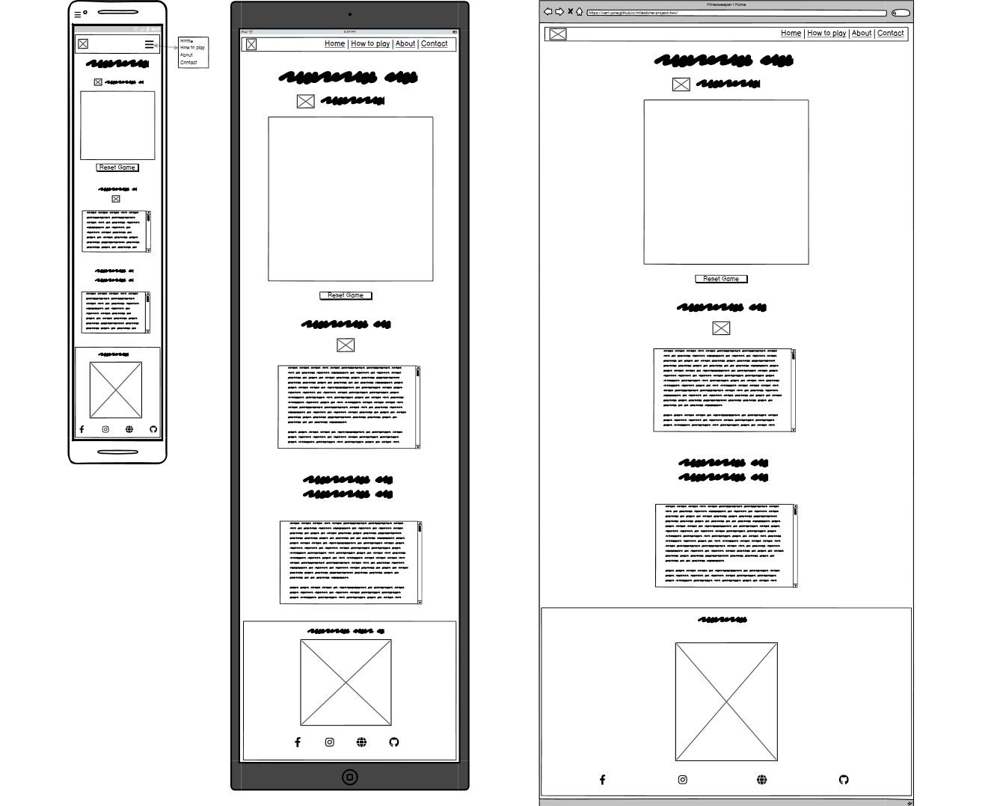
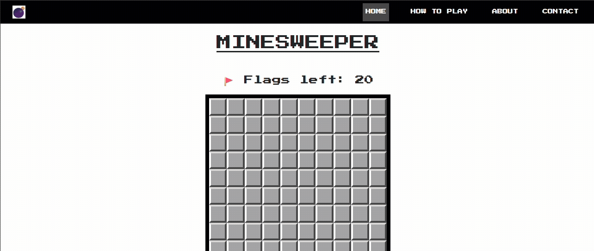
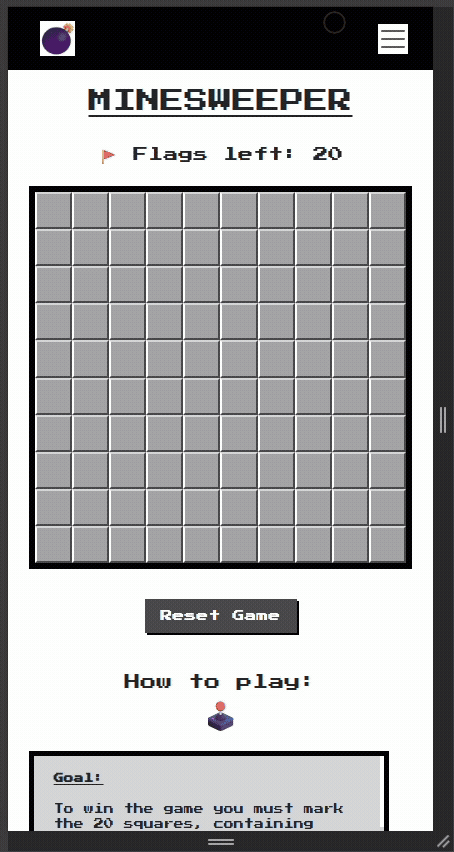
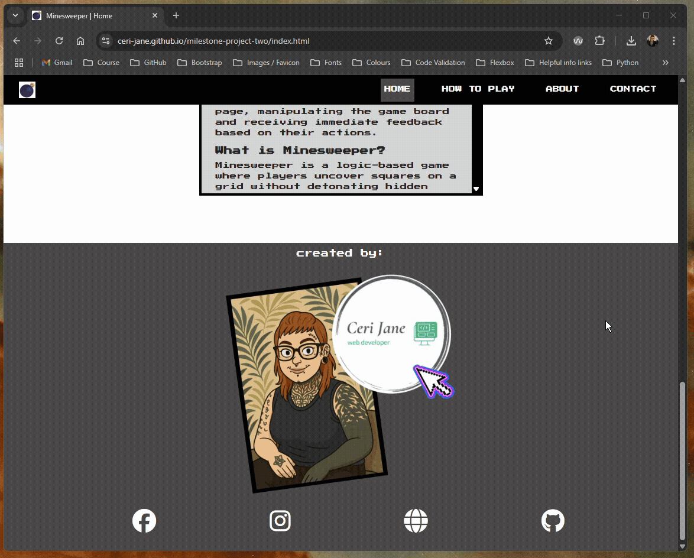

# Minesweeper Game
----------

An interactive front-end site which allows both user and creator to actively engage with data, alter the way the site displays the information to achieve their preferred goals.
* Required: HTML, CSS, JavaScript.
* Optional: jQuery or any other JavaScript libraries, external APIs.

Visit the deployed site [here](https://ceri-jane.github.io/milestone-project-two/index.html) on GitPages 

----------
## Contents
----------

* [User Stories](#user-stories)
    * [User Story 1](#user-story-1)
    * [User Story 2](#user-story-2)
    * [User Story 3](#user-story-3)
    * [User Story 4](#user-story-4)
    * [User Story 5](#user-story-5)
    * [User Story 6](#user-story-6)
    * [User Story 7](#user-story-7)
    
* [UX Design](#ux-design)
    * [Strategy](#strategy)
    * [Scope](#scope)
    * [Structure](#structure)
    * [Skeleton](#skeleton)
    * [Surface](#surface)
    * [Wireframe](#wireframe)
    * [Responsive Design Considerations](#responsive-design-considerations)

* [Visual Design](#visual-design)
    * [Colour Palette](#colour-palette)
    * [Font](#font)

* [Features](#features)
    * [Navigation Bar](#navigation-bar)
    * [Game Area](#game-area)
    * ["How To Play" Section](#how-to-play-section)
    * ["About" Section](#about-section)
    * [Footer](#footer)   
    * [Favicon And Page Title](#favicon-and-page-title)

* [Technologies And Tools](#technologies-and-tools)

* [Testing](#testing)

* [Site Deployment](#site-deployment)

* [Credits](#credits)

----------
## User Stories
----------

### <u>User Story 1</u>
- **Feature Title:** Interactive gameplay with real-time feedback (must-have)
- **User Story:** As a returning player, I want immediate feedback when I interact with the grid so I can make informed decisions based on the game’s current state.
- **Acceptance Criteria:**
  - Clicking reveals tiles with numbers or bombs instantly.
  - Flag count updates dynamically as flags are placed.
- **Tasks:**
  - Add JavaScript logic to update tile states and the flags left display.
  - Display win/loss messages upon game completion.

[Back to contents](#contents)

### <u>User Story 2</u>
- **Feature Title:** Responsive game interface and mobile compatibility (must-have)
- **User Story:** As a mobile user, I want the game interface to adapt to my screen size and support touch controls so I can play easily on my phone or tablet.
- **Acceptance Criteria:**
  - The game layout adapts smoothly to smaller screens.
  - Long-press support is available for placing flags on mobile.
- **Tasks:**
  - Use Bootstrap grid and media queries to create a responsive layout.
  - Implement touch event handlers for long-press functionality.

[Back to contents](#contents)

### <u>User Story 3</u>
- **Feature Title:** Clear visual design and game state indicators (must-have)
- **User Story:** As a player, I want the game to clearly show which tiles are revealed, flagged, or unexplored so I can quickly understand the current game state.
- **Acceptance Criteria:**
  - Each tile state (hidden, flagged, revealed) is visually distinct.
  - Bombs and numbers are styled clearly with consistent colour schemes.
- **Tasks:**
  - Style game tiles using CSS classes based on their state.
  - Use colours and icons to visually differentiate flags, bombs, and numbers.

[Back to contents](#contents)

### <u>User Story 4</u>
- **Feature Title:** Game restart and session reset functionality (should-have)
- **User Story:** As a user who finishes a game or makes a mistake, I want a clear way to restart the game so I can quickly begin a new session.
- **Acceptance Criteria:**
  - A reset button is available and resets the grid and all variables.
  - The flag counter and result message also reset properly.
- **Tasks:**
  - Create a JavaScript function that resets the game state.
  - Attach the function to a clickable reset button element.

[Back to contents](#contents)

### <u>User Story 5</u>
- **Feature Title:** Simple, intuitive rules and information layout (should-have)
- **User Story:** As a new user unfamiliar with Minesweeper, I want access to simple instructions so I can understand how to play without confusion.
- **Acceptance Criteria:**
  - A “How to Play” section is included and easily accessible.
  - Rules are written in a friendly, non-technical tone.
- **Tasks:**
  - Add a dedicated section or modal with gameplay instructions.
  - Link to it from the navbar or game interface.

[Back to contents](#contents)

### <u>User Story 6</u>
- **Feature Title:** Transparent use of game rules and fairness (must-have)
- **User Story:** As a curious or experienced player, I want to feel confident that the game behaves fairly and consistently, so I can trust the outcome of each game and enjoy a reliable experience.
- **Acceptance Criteria:**
  - Game rules and behaviour are clearly explained in the “How to Play” section.
  - Random bomb placement and game logic are predictable and repeatable in design (not rigged or broken).
- **Tasks:**
  - Include a short explanation of how bombs are placed and what the numbers mean.
  - Make sure randomisation is handled correctly in JavaScript and explained if needed.
  - Add notes to the “How to Play” or “About” section clarifying that the game logic is based on classic Minesweeper rules.

[Back to contents](#contents)

### <u>User Story 7</u>
- **Feature Title:** Difficulty level selector (could-have)
- **User Story:** As a regular player, I want to choose from different difficulty levels (e.g., easy, medium, hard) so I can tailor the game’s challenge to my skill level or mood.
- **Acceptance Criteria:**
  - A dropdown or buttons allow users to select a difficulty before starting the game.
  - Each difficulty level adjusts the grid size and number of bombs accordingly.
- **Tasks:**
  - Add UI controls (e.g., buttons or dropdown) for selecting difficulty.
  - Modify the game logic to initialize different grid sizes and bomb counts based on the selected level.
  - Ensure the reset function respects the chosen difficulty.

[Back to contents](#contents)

----------
## UX Design
----------

### <u>Strategy</u>
The core purpose of the project is to present interactive data through a familiar, logic-based puzzle—Minesweeper. The game encourages users to engage actively with a dynamic interface where their decisions directly influence the data displayed (revealed tiles, flag counts, etc.). This project meets user needs by enabling a custom experience: users can play at their own pace, test strategies, and derive satisfaction through problem-solving. As the site owner and developer, I benefit from this project by using it to showcase JavaScript proficiency and front-end development skills, as well as by enjoying the game myself as a user.

[Back to contents](#contents)

### <u>Scope</u>
The application focuses on delivering a complete Minesweeper experience in the browser using HTML, CSS, and JavaScript, with optional support from libraries like Bootstrap for responsive design. The scope includes:
- A fully functional grid-based logic game.
- Real-time interaction (clicking to reveal squares, right-click or long-press to flag).
- A responsive, mobile-friendly layout.
- Game state updates (e.g. win/loss detection, flags left).
- Structured documentation and attribution of any external sources.

All interactive features were built with custom JavaScript code to fulfill the "dynamic front-end" requirement.

[Back to contents](#contents)

### <u>Structure</u>
The structure of the site follows a clear flow: users land on the game interface, can immediately begin playing, and receive feedback in real time. The navigation is minimal but effective, with a responsive navbar ensuring users can access key areas (e.g., "How to Play", "About", etc.) from any device. The internal logic of the game—like bomb placement, flagging, and win conditions—is designed to be intuitive and mirror the original Minesweeper mechanics, ensuring users understand the rules and structure with minimal instruction.

[Back to contents](#contents)

### <u>Skeleton</u>
The interface design prioritizes ease of use. Game controls are placed in familiar positions (e.g., a flag counter, reset button), and touch interaction is optimized with mobile-friendly long-press support. The layout uses Bootstrap to maintain alignment, spacing, and scaling across devices, ensuring visual consistency. The grid itself is styled with clarity in mind: distinct visual cues differentiate hidden tiles, revealed numbers, and flagged squares. Feedback is immediate and contextual—for example, uncovering a bomb or achieving victory triggers appropriate UI changes.

[Back to contents](#contents)

### <u>Surface</u>
The visual design is clean and classic, echoing the original Minesweeper aesthetic while updating it for modern devices. A muted colour palette provides contrast without distraction, and hover/click/touch states give visual feedback. Icons and emojis are used to support understanding without relying on text. The typography is legible across devices, and buttons and interactive areas follow accessibility guidelines for size and spacing. The surface layer ties together the logic and interactivity in an inviting, familiar, and responsive interface.

[Back to contents](#contents)

---

### <u>Wireframe</u>

The wireframes for this Minesweeper project were created in **Balsamiq** to plan the layout across **mobile, tablet, and desktop devices**, ensuring a responsive and user-friendly experience. They represent the **Skeleton Plane** in the UX design process, defining the placement of core elements such as the navigation menu, game board, reset button, instructional sections, and footer links. The design prioritizes user goals outlined in the user stories, including easy navigation via a **hamburger menu on mobile**, quick game resets, and accessible instructions on how to play.  

This work aligns with the **Five Planes of UX Design** by translating the strategy and scope into a clear structure and skeleton, ultimately forming the foundation for the surface design.

[Back to contents](#contents)

---

### <u>Responsive Design Considerations</u>
To ensure the site adapts to different screen sizes, **CSS media queries** were implemented for key breakpoints:  
- **320px** (small mobile devices)  
- **425px** (large mobile devices)  
- **768px**+ (tablet devices and above)  

These breakpoints adjust the **navigation layout**, **game area size**, and **text content positioning** for an optimal user experience on all devices.

[Back to contents](#contents)

----------
## Visual Design
----------

### <u>Colour Palette</u>

The chosen color palette is inspired by **retro computing aesthetics**, reflecting the classic Minesweeper look while maintaining a clean and modern feel. It features a **neutral grey background**, accented with **black borders** and subtle highlights to mimic the original 90s desktop style. Numbered tiles use **distinct, bold colors** for each digit (e.g., green, blue, purple, brown), which enhances visibility and reinforces the nostalgic theme.  

This simplistic approach ensures **clarity, contrast, and consistency**, making the interface easy to read while preserving the retro vibe that users expect from a Minesweeper game. The minimalistic scheme avoids unnecessary decoration, focusing attention on the game board and user interactions.  

**Color Swatches:**  
- Game bckground (light grey):  `light grey`
- Borders, text, game board numbers 5 and above, nav bar background:  `black`
- Left highlight, nav bar text:  `white`
- Top highlight, nav link highlight:  `lighter grey`
- Shaddow colour, nav bar home link background, button background, footer background:  `darker grey`
- Text/Numbers:
  - 1:  `dark green`
  - 2:  `dark blue`
  - 3:  `dark pink`
  - 4:  `brown`

[Back to contents](#contents)

---

### <u>Font</u>

The project uses **Press Start 2P**, a pixelated, monospaced typeface inspired by old-school video game text. This font reinforces the retro aesthetic while maintaining readability across devices. Its bold, blocky characters echo the design language of classic arcade games, creating a strong sense of nostalgia that complements the minimalist color palette.  

The combination of **retro typography** and **simplistic color scheme** creates a cohesive visual identity that is both functional and stylish, delivering a familiar yet polished Minesweeper experience.

[Back to contents](#contents)

----------
## Features
----------

### <u>Navigation Bar</u>

The navigation bar is **fixed to the top of the page** for easy access and is fully responsive. On smaller screens, it collapses into a **hamburger menu**, improving usability on mobile devices. JavaScript code ensures the burger menu collapses once an internal link has been selected.
It provides links to **Home**, **How to Play**, **About**, and **Contact** sections.

**Key points:**
- **Always visible** due to its fixed position.
- **Accessible and responsive**, switching between horizontal layout and a collapsible menu.
- **Bomb icon** and **Home** link to take the user back to the top of the page.
- **Link hover and selection highlight** to help the user navigate to where they want to go.

1. Navigation bar on desktop and tablet

2. Navigation bar collapsed into hamburger menu on mobile

[Back to contents](#contents)

### <u>Game Area</u>

The **interactive Minesweeper game board** is the main feature of the site.  
Players can:
- **Click tiles** to reveal safe squares or bombs.
- See **numbers indicating adjacent bombs**, adding logic-based strategy.
- **Flag suspected bombs** using right-click (desktop) or **long press** (mobile/tablet).

**Additional Features:**
- **Game status indicator** (e.g., “Game Over” or “You Win”).
- **Flags left counter** for better gameplay awareness.
- **Reset Button** to start a new game without refreshing the page.

1. Full game area on desktop and tablet

2. Game area on mobile

[Back to contents](#contents)

### <u>"How To Play" Section</u>

A dedicated section provides **step-by-step instructions** on how to play Minesweeper, making the game accessible for new players.  
This section uses **clear headings and bullet points**, ensuring easy readability on all devices.
The text is contained in a scroll box.

1. How to Play on desktop and tablet

2. How to Play on mobile

[Back to contents](#contents)

### <u>"About" Section</u>

The About section explains:
- The **purpose of the project**.
- The **technologies used** (HTML, CSS, JavaScript).
- **Responsive design principles** implemented.
The text is contained in a scroll box.

1. About section on desktop and tablet

2. About section on mobile

[Back to contents](#contents)

### <u>Footer</u>  

The footer is **fixed at the bottom** of each page and contains:
- The creators logo.
- **Social media and GitHub icons** linking to the creators external platforms.

Consistent with the **retro color palette** and **minimal design** of the site.

1. Footer on desktop and tablet

2. Footer on mobile

[Back to contents](#contents)

### <u>Favicon And Page Title</u> 

The page includes a **favicon** generated using [favicon.io](https://favicon.io), ensuring the site feels polished and consistent across devices and browsers.  
The favicon reflects the retro theme of the game and matches the branding of the website.  

Additionally, the **page title** is set using the `<title>` element, making navigation easier for users and improving SEO.  

1. Favicon and page title on desktop

2. Favicon and page title on mobile and tablet

[Back to contents](#contents)

----------
## Technologies And Tools
----------

* HTML5
used to create website content and basic structure.

* CSS3
used to style the website/html.

* JavaScript (Vanilla)  
Handles the **game logic**, including:
  - Generating a **dynamic game board**.
  - Implementing **click and flag interactions**.
  - Managing **win and game-over conditions**.
  - Adding **long-press support** for mobile flagging.

* [VS (Visual Studio) Code](https://code.visualstudio.com/)
Used to create website code and repository content.

* [GitHub](https://github.com/)
Used to store the repository, deploy the site, version control on each feature added/fixed/removed.

* [Balsamiq](https://balsamiq.com/wireframes/)
Used to create initial wireframe.

* [Font Awesome](https://fontawesome.com/)
Icons used on the website. 

* [Google fonts](https://fonts.google.com/)
Fonts.

* [Favicon generator](https://favicon.io/favicon-converter/)
Generate favicons.

* [WebAim](https://webaim.org/resources/contrastchecker/)
Contrast checker.

* [Wave](https://chromewebstore.google.com/detail/wave-evaluation-tool/jbbplnpkjmmeebjpijfedlgcdilocofh)
Google Chrome ext. = Web accessibility evaluation tool.

* [Bootstrap](https://getbootstrap.com/)
Software library.

* [w3schools](https://www.w3schools.com/)
JavaScript functionality was implemented with the help of resources and examples from w3schools.

* [W3C HTML](https://validator.w3.org/) 
HTML validator.

* [W3C CSS](https://jigsaw.w3.org/css-validator/)
CSS code validator.

* [JSLint](https://www.jslint.com/)
JavaScript code validator.

* [ChatGPT](https://chatgpt.com/)
Help to solve bugs.

* [Autoprefixer CSS online](https://autoprefixer.github.io/)
PostCSS plugin which parses CSS code and adds vendor prefixes.

* [Lighthouse](https://chromewebstore.google.com/detail/lighthouse/blipmdconlkpinefehnmjammfjpmpbjk)
Google Chrome dev. tool = Help to improve website quality

* [Adobe Express](https://www.adobe.com/express/feature/video/convert/video-to-gif?gclid=CjwKCAjwnPS-BhBxEiwAZjMF0h13UOgxW20SWh02aBVY2-281qHn-iu2PAC9MeBSYIkCEs4vlzvO2hoCHuEQAvD_BwE&mv=search&mv2=paidsearch&sdid=VG52K9CC&ef_id=CjwKCAjwnPS-BhBxEiwAZjMF0h13UOgxW20SWh02aBVY2-281qHn-iu2PAC9MeBSYIkCEs4vlzvO2hoCHuEQAvD_BwE:G:s&s_kwcid=AL!3085!3!712839714627!b!!g!!turn%20video%20into%20gif!21677700915!169634613760&gad_source=1)
Convert mp4 video files into gif files

* [Snipping tool app](https://apps.microsoft.com/detail/9mz95kl8mr0l?hl=en-GB&gl=GB)
Used to screenshot and record my work.

[Back to contents](#contents)

----------
## Testing
----------

Please click [here](assets/testing/TESTING.md) for detailed information on testing Minesweeper.

[Back to contents](#contents)

----------
## Site Deployment
----------

The deployment of the site was done through GitHub pages through the following steps:

    1. In the Minesweeper GitHub repository, click on settings.
    2. Scroll down and select the pages tab.
    3. In the branch dropdown menu, select "main".
    4. Click save.
    5. Refresh the page to view the deployed website link.

The repository link is [here](https://github.com/Ceri-Jane/milestone-project-two)

[Back to contents](#contents)

----------
## Credits
----------

* The core logic for the Minesweeper game was inspired by a YouTube tutorial by [Ania Kubów](https://www.youtube.com/watch?v=jS7iB9mRvcc).

This video provided an introduction to implementing the game using HTML, CSS, and JavaScript. The video served as a learning resource for understanding key concepts such as creating a grid, placing bombs randomly, and handling click events.  

However, the code in this project was **significantly adapted and extended** to meet my own design goals and requirements. I customized the functionality, added new features (such as a reset button, mobile long-press support for flagging, and responsive design), the ability to work on both android and ios operating systems and styled the interface to achieve a unique retro-inspired look that aligns with the project’s UX strategy. 

* The creator logo rights are owned by me.

* Code Institute mentor = Constructive criticism

[Back to contents](#contents)