# Testing
----------

Here you will find all tests performed on the Minesweeper Game site.

Return to [README.md](README.md)

----------
## Contents
----------

* [User stories](#user-stories)
  * [Excluded Feature](#excluded-feature)

* [Contrast](#contrast)

* [Accessibility Testing](#accessibility-testing)

* [Performance Testing](#performance-testing)

* [Browser Compatibility](#browser-compatibility)

* [Bug Log](#bug-log)

* [HTML Code](#html-code)

* [CSS Code](#css-code)

* [JavaScript Code](#javascript-code)

* [Responsive Check](#responsive-check)

* [Navigation Check](#navigation-check)

* [Game Area Check](#game-area-check)

* ["How To Play" Section Check](#how-to-play-section-check)

* ["About" Section Check](#about-section-check)

* [Footer Check](#footer-check)

* Back to [README.md](README.md)

----------
## User Stories
----------

 

| User Story | Feature Title                                     | Type        | Description                                                                 | Dependencies                                         | Completed |
|:----------:|---------------------------------------------------|-------------|-----------------------------------------------------------------------------|----------------------------------------------------|:---------:|
| 1          | Interactive gameplay with real-time feedback      | Must-have   | Core logic for revealing tiles, placing flags, and tracking win/loss state. | None (Foundational feature for all other stories)  |     ✓     |
| 2          | Responsive game interface and mobile compatibility| Must-have   | Layout adjusts for screens; long-press support on mobile.                   | Gameplay logic                                     |     ✓     |
| 3          | Clear visual design and game state indicators     | Must-have   | Visual styling for different tile states using CSS.                         | Gameplay logic                                     |     ✓     |
| 4          | Game restart and session reset functionality      | Should-have | Allows users to restart without refreshing the page.                        | Gameplay logic                                     |     ✓     |
| 5          | Simple, intuitive rules and information layout    | Should-have | Add "How to Play" section; explain game rules.                              | Layout/navigation in place                         |     ✓     |
| 6          | Transparent use of game rules and fairness        | Must-have   | Help players trust that game logic is fair, consistent, and not rigged.     | “How to Play” content in place                     |     ✓     |
| 7          | Difficulty level selector                         | Could-have  | Allow users to choose grid size and bomb count.                             | Gameplay logic, reset functionality                 |     X     |

### Excluded Feature
**Difficulty Level Selector (User Story 7)**

**Reason for Exclusion:**  
The difficulty level selector was identified as a **"Could-Have"** feature under the MoSCoW prioritization model. While it would enhance replayability and provide players with more control over their experience, it was not essential to the core functionality of the game for this phase of development. Implementing this feature would require additional logic for dynamic grid generation, bomb placement adjustments, and UI controls, which could significantly increase development time and complexity.

**Future Enhancement:***  
Introducing difficulty levels in a future iteration would be a valuable improvement. It would allow players to tailor the challenge to their skill level and add variety to the gameplay, making the project more engaging and polished. Planned approaches include:
- Adding UI elements (buttons or dropdown) for difficulty selection.
- Scaling grid size and bomb count based on chosen difficulty.
- Ensuring that the reset and restart functions respect the selected difficulty.

*_[See Future Improvements in README.md](README.md#future-improvements)_

[Back to contents](#contents)

Return to [README.md](README.md)

----------
## Contrast
----------

The **WebAIM Contrast Checker** was used to manually verify that the chosen colour palette meets **WCAG contrast ratio guidelines** for accessibility. This ensures that all text and interactive elements are readable for users, including those with visual impairments.

Each combination of **text colour** and **background colour** from the site’s colour palette was tested. All results met the required contrast ratios for **normal text (4.5:1)** and **large text (3:1)**, ensuring compliance with WCAG 2.1 standards.

**Screenshots of individual contrast checks are included below** as evidence of accessibility compliance.

1. Black and white contrast check.

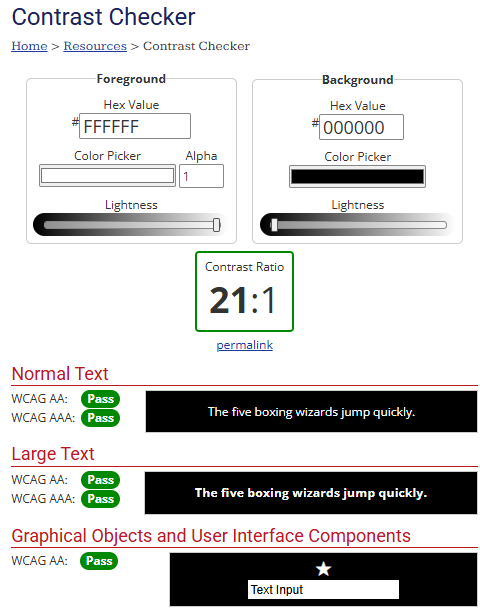

2. Nav bar link highlight check.

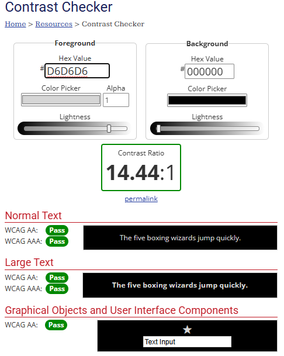

3. Footer check.

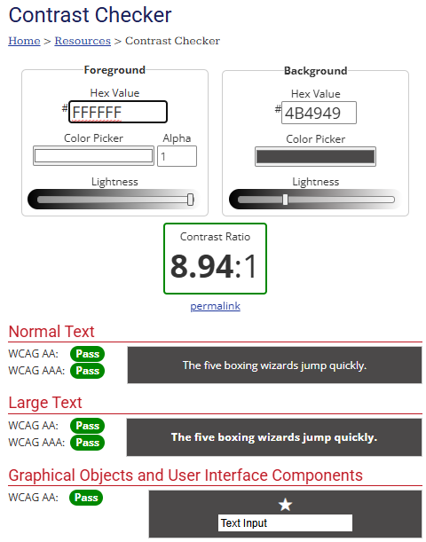

4. Each number in the game grid check.

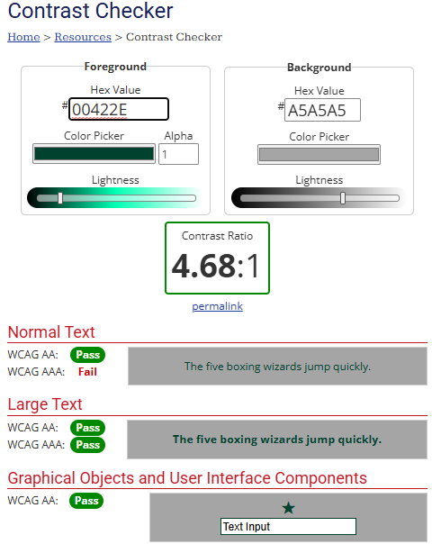

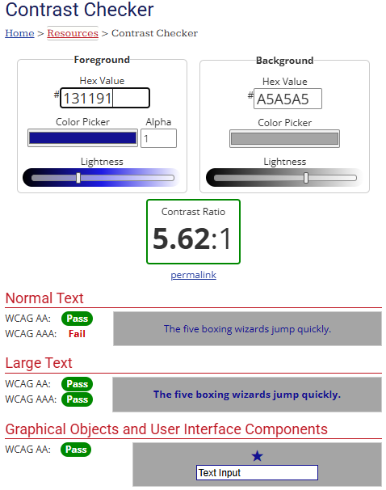

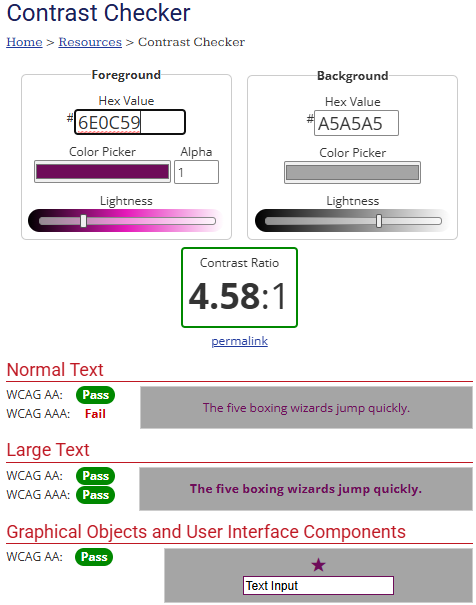

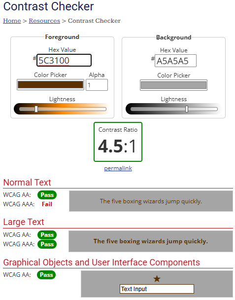

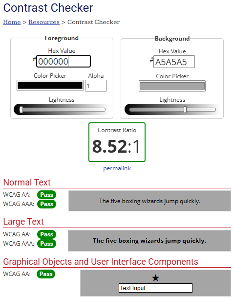

I was confident with any other potential contrast issues due to the next test performed using "WAVE" dev. tool.

[Back to contents](#contents)

Return to [README.md](README.md)

----------
## Accessibility Testing
----------

The **WAVE Web Accessibility Evaluation Tool** was used to check the site for accessibility compliance. This tool helps identify issues that might affect users with disabilities, ensuring the site follows **WCAG (Web Content Accessibility Guidelines)**.

**Why WAVE was used:**
- To verify that text has sufficient **colour contrast** for readability.
- To ensure **alt attributes** are present on images for screen readers.
- To check for **semantic HTML structure**, making the site accessible for assistive technologies.
- To confirm that **navigation elements** (such as the hamburger menu and links) are accessible via keyboard and screen readers.
- To identify and correct **ARIA attributes** and other accessibility issues.

By using WAVE, the project aims to provide an inclusive experience for all users, aligning with best practices in web development.

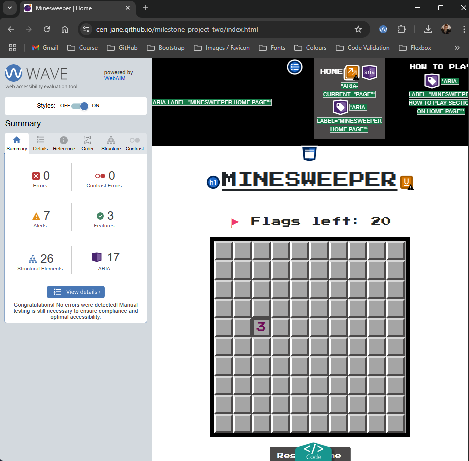

Below is a summary of the **Alerts (7)**:

- **2 Possible Headings**  
  - Possible heading 1  
  - Possible heading 2  
- **1 Redundant Link**  
  - Redundant link 1 *(Note: This is the **Home link** in the navigation bar, which duplicates functionality of the site logo. This is intentional to improve navigation accessibility.)*  
- **4 Underlined Text**  
  - Underlined text 1  
  - Underlined text 2  
  - Underlined text 3  
  - Underlined text 4  

The WAVE report flagged **7 alerts**, mostly related to possible headings, redundant links, and underlined text that may be mistaken for links.  
The redundant link alert is **intentional** because the Home link duplicates the clickable logo for improved navigation accessibility.  
No critical errors were found, and the site includes essential accessibility features such as **alternative text, semantic headings, ARIA roles, and labels**.

[Back to contents](#contents)

Return to [README.md](README.md)

----------
## Performance Testing 
----------

The site was tested using **Google Lighthouse** to evaluate performance, accessibility and best practices.

| Metric         | Score  |
|---------------|--------|
| Performance    | 86%    |
| Accessibility  | 100% |
| Best Practices | 100% |

**Lighthouse Summary:**
A performance score of **86%** is considered good for an interactive JavaScript game. The slightly reduced score is due to the additional resources and dynamic DOM updates required for game functionality.

Performance Report

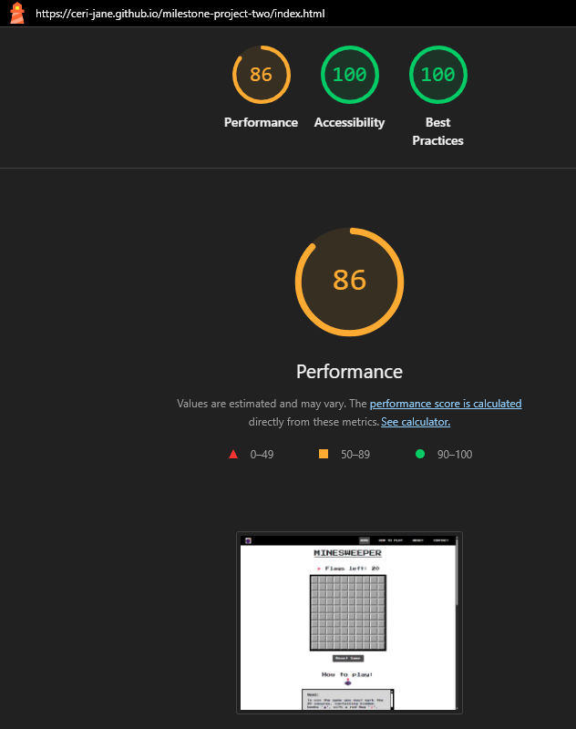

[Back to contents](#contents)

Return to [README.md](README.md)

**Potential Improvements**:
- **Optimize Images:** Use compressed formats for icons/screenshots.
- **Minify CSS and JavaScript:** Reduce file sizes for faster loading.
- **Defer JavaScript:** Use `defer` in script tags to avoid render-blocking.
- **Remove Unused CSS/JS:** Streamline code for efficiency.
- **Enable Compression:** Use Gzip or Brotli if supported by hosting.

Despite these recommendations, the current score ensures **fast load times and smooth gameplay across devices.**

[Back to contents](#contents)

Return to [README.md](README.md)

----------
## Browser Compatibility 
----------

The site was tested on the following devices and browsers:

**Devices:**
- Desktop (Windows 10)
- Tablet (iPad, Samsung Galaxy Tablet)
- Mobile (Samsung Galaxy, iPhone)

**Browsers:**
- Chrome
- Firefox
- Edge
- Safari
- Samsung Internet

**Test Cases:**
| Feature                           | Expected Result                           | Pass/Fail |
|-----------------------------------|-----------------------------------------|:----------:|
| Navigation links                  | All links navigate correctly           | ✅ |
| Hamburger menu                    | Expands/collapses on mobile            | ✅ |
| Game grid loads                   | Grid appears correctly on load         | ✅ |
| Left-click tile (desktop)         | Reveals number/blank or bomb           | ✅ |
| Right-click tile (desktop)        | Flags/unflags tile                     | ✅ |
| Long-press tile (mobile/tablet)   | Flags/unflags tile                     | ✅ |
| Reset button                      | Resets game without page refresh       | ✅ |
| Footer links                      | All social/GitHub links open correctly | ✅ |
| Responsive layout                 | Displays correctly on all screen sizes | ✅ |

[Back to contents](#contents)

Return to [README.md](README.md)

----------
## Bug Log 
----------

| Bug ID | Bug Description                                      | Cause                                    | Fix Implemented                              | Status  |
|:--------:|-------------------------------------------------------|------------------------------------------|----------------------------------------------|:---------:|
| 1      | Right-click opens browser context menu on desktop    | Default browser event interferes         | Added `event.preventDefault()` in JS        | Fixed   |
| 2      | Long-press flagging not working on iOS               | Safari handles `contextmenu` differently | Added custom long-press detection with `touchstart` & `touchend` | Fixed   |
| 3      | Instructions text overflowing on smaller screens     | CSS overflow not set properly            | Added `overflow: auto` and media queries    | Fixed   |
| 4      | Navbar links didn’t collapse after click on mobile   | Missing collapse trigger in JS           | Added `data-bs-toggle` and collapse script  | Fixed   |
| 5      | Incorrect flags left counter after reset             | Flag variable not reset in function      | Reset flags count in `resetGame()` function | Fixed   |

**Unfixed Bugs:**  
None remain. All identified issues were resolved during testing.

[Back to contents](#contents)

Return to [README.md](README.md)

----------
## HTML Code 
----------

The HTML code was tested using the [W3C Markup Validation Service](https://validator.w3.org/#validate_by_input).  
**Result:** No errors were found in the HTML code, confirming that the markup is valid and meets W3C standards.

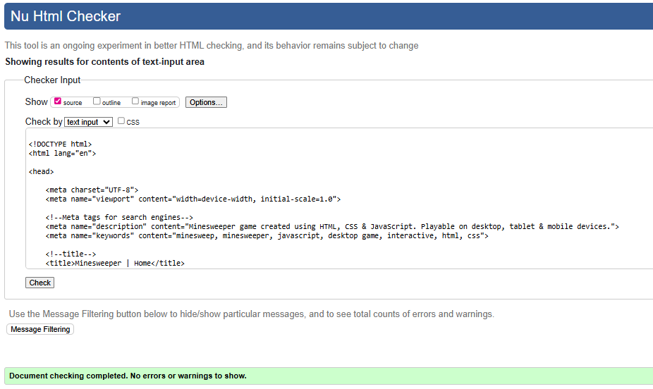

[Back to contents](#contents)

Return to [README.md](README.md)

----------
## CSS Code 
----------

The CSS code was tested using the [W3C CSS Validation Service](https://jigsaw.w3.org/css-validator/#validate_by_input).  
**Result:** No errors were found in the CSS code, confirming that the stylesheets meet W3C standards for valid CSS.

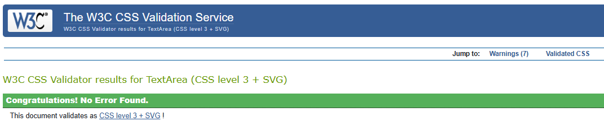

[Back to contents](#contents)

Return to [README.md](README.md)

----------
## JavaScript Code 
----------

The JavaScript code was checked using **JSLint**, which reported the following warnings:

1. **Unexpected 'let'**
2. **Unexpected 'for'**

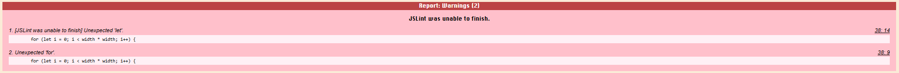

These warnings occur because **JSLint defaults to older ECMAScript standards**, which do not fully support ES6 features such as `let` or modern `for` loops.  
The project uses **ES6 syntax intentionally** for cleaner and more efficient code. These warnings were therefore **ignored** as the code functions correctly across modern browsers.

I also checked my JavaScript code with ChatGPT. Here is a summary and fixes I implemented off the back of that:

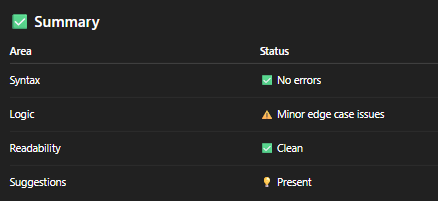

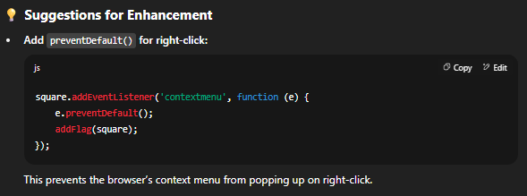

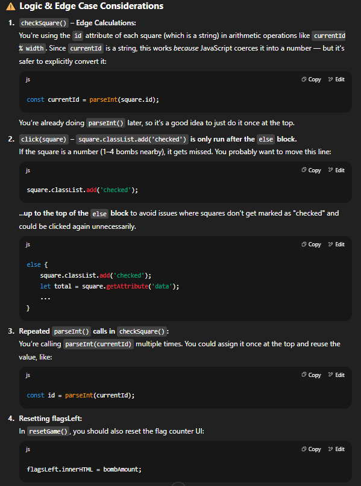

[Back to contents](#contents)

Return to [README.md](README.md)

----------
## Responsive Check 
----------

The site was designed and developed to be fully responsive, providing an optimal user experience across different screen sizes. I implemented **CSS media queries** at key breakpoints:

- **320px** (small mobile devices)
- **425px** (large mobile devices)
- **768px and above** (tablet and desktop)

**Work completed to achieve responsiveness:**
- Elements are stacked vertically on **all screen sizes**, but the **width and height of key elements (game board, buttons, text areas)** were adjusted for each breakpoint to maintain balance and usability.
- Implemented a **collapsible hamburger menu** for easy navigation on mobile devices.
- Dynamically resized the **game board** so it fits comfortably within the viewport on all devices.
- Scaled text, buttons, and interactive elements to ensure usability and readability across all breakpoints.
- Ensured **footer and navigation elements** remain accessible without overlapping or pushing content off-screen.

A video demonstration of the site across different screen sizes (**320px, 425px, 768px, and desktops**) is included below to showcase responsive behaviour.

[Back to contents](#contents)

Return to [README.md](README.md)

----------
## Navigation Check 
----------

- **Purpose:** To ensure the navigation bar functions correctly and adapts to screen size.
- **Tests Performed:**
  - Verified that all navigation links **scroll smoothly to the relevant section**:
    - **Home and Bomb icon** scrolls to the top of the page.
    - **How To Play** scrolls to the instructions section.
    - **About** scrolls to the About section.
    - **Contact** scrolls to the footer where the creator logo and contact information is displayed in the form of clickable social media links.
  - Checked that the navigation bar remains **fixed at the top** of the screen when scrolling.
  - On mobile:
    - Confirmed that the **hamburger menu opens and closes correctly**.
    - Verified all links inside the dropdown are clickable and functional, also scrolling to the correct section.
- **Result:** All navigation elements worked as expected on desktop and mobile.

[Back to contents](#contents)

Return to [README.md](README.md)

----------
## Game Area Check 
----------

- **Purpose:** To confirm that the Minesweeper game functions properly on all devices.
- **Tests Performed:**
  - Clicked squares to ensure they reveal numbers, empty spaces, or bombs correctly.
  - Verified that bomb placement is randomized on each new game.
  - Checked **flagging functionality**:
    - Right-click on desktop places and removes flags.
    - Long-press on mobile and tablet places and removes flags.
  - Tested the **Reset Game** button to confirm it resets the board without page refresh.
  - Verified the **flag counter updates correctly** based on how many flags are placed/removed.
  - Confirmed that the correct **game status message displays**:
    - “Game Over” when a bomb is clicked.
    - “You Win” when all safe tiles are correctly flagged.
- **Result:** Game area features worked correctly on desktop and mobile/tablet.

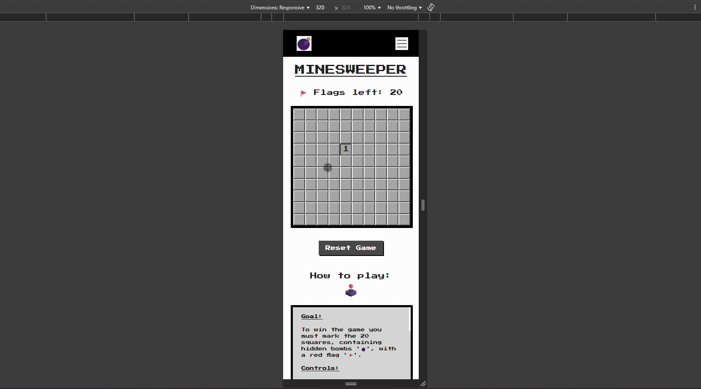

During testing on desktop, I discovered that **right-clicking on a tile to place or remove a flag also triggered the browser's default context menu**, which disrupted the game experience. This issue made it difficult for users to play using the intended right-click flagging functionality.

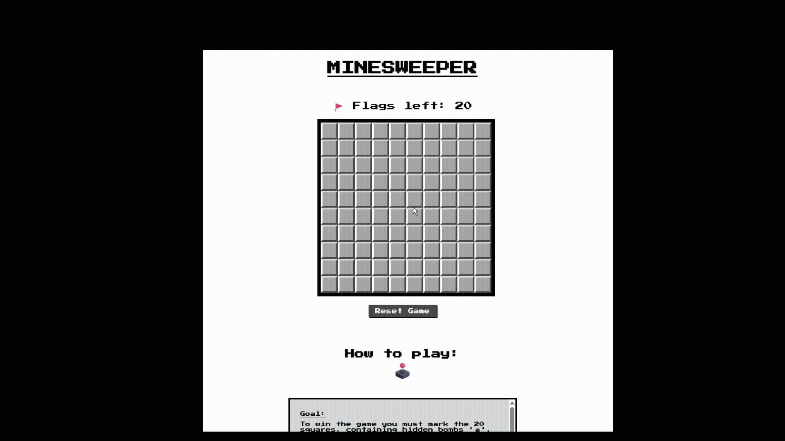

To fix this, I added a JavaScript event listener that uses the `contextmenu` event and calls `event.preventDefault()`. This prevents the default browser menu from appearing when a player right-clicks a tile, allowing the game to correctly register the flagging action.

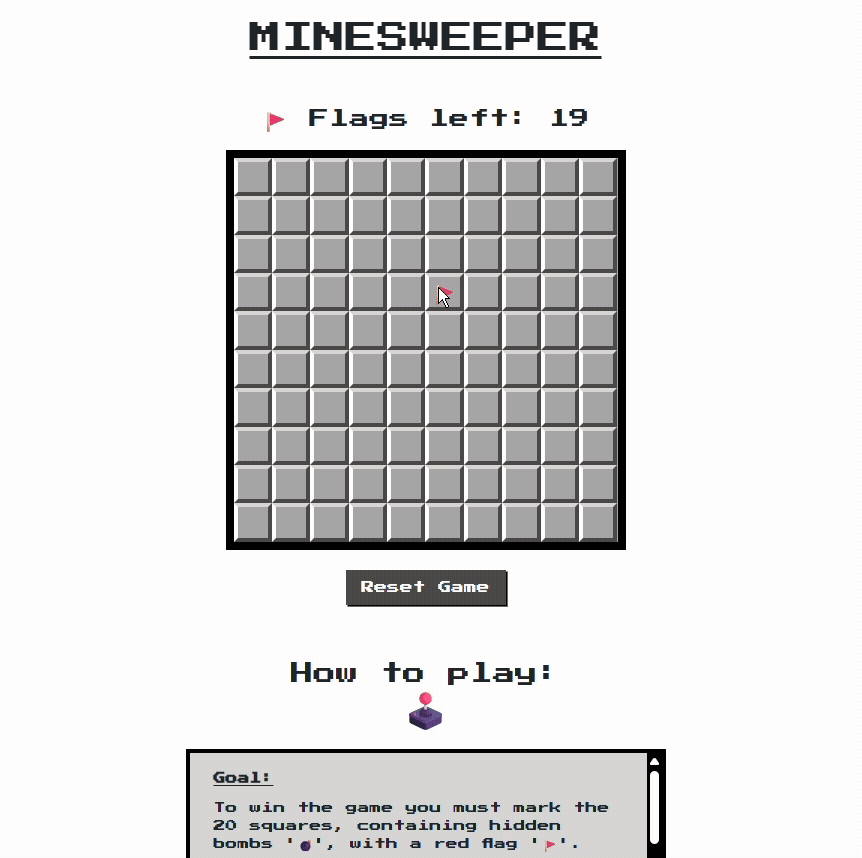

### Issue: Long-Press Flagging Not Working on iOS Devices

**Description:**  
The game includes a feature that allows users on mobile devices to **place or remove flags using a long-press gesture**, since right-click is not available on touchscreens. During testing, this feature worked correctly on Android devices (e.g., Samsung), but did **not work on iOS devices (iPhone/iPad)** because **Safari on iOS handles long-press events differently**, often triggering text selection or other native actions instead of firing the intended event.

**Solution:**  
To address this, I implemented a platform check in JavaScript to detect iOS devices and then adjusted the event handling. Specifically:
- Added a function to detect if the user is on iOS.
- Applied a custom **long-press timer using `touchstart` and `touchend` events**, while preventing the default iOS behaviour that interfered with the gesture.

[Back to contents](#contents)

Return to [README.md](README.md)

----------
## "How To Play" Section Check 
----------

- **Purpose:** To ensure instructions are clear, properly contained, and accessible on all devices.
- **Tests Performed:**
  - Verified that the section appears correctly on all screen sizes.
  - Checked that text remains readable without overlapping or breaking layout.
  - Confirmed the instructions remain inside the **scrollable box** and do not spill out on any screen size.
  - Confirmed internal navigation link scrolls to this section smoothly from the navigation bar.
- **Result:** Section displayed and functioned as intended on all devices.

[Back to contents](#contents)

Return to [README.md](README.md)

----------
## "About" Section Check 
----------

- **Purpose:** To confirm the About section displays project information clearly and maintains layout integrity.
- **Tests Performed:**
  - Checked alignment and readability across all devices.
  - Verified that the text remains inside its container without spilling or causing horizontal scrolling on any screen size.
  - Confirmed internal navigation link scrolls correctly to this section from the navigation bar.
- **Result:** Section displayed as expected on desktop and mobile.

[Back to contents](#contents)

Return to [README.md](README.md)

----------
## Footer Check 
----------

- **Purpose:** To ensure the footer displays correctly and remains functional.
- **Tests Performed:**
  - Verified that **social media icons** and **GitHub link** open in a new tab and point to the correct URLs.
  - Checked footer alignment and responsiveness on different screen sizes.
  - Confirmed the footer does not overlap any content.
- **Result:** Footer worked as expected on all devices.

[Back to contents](#contents)

Return to [README.md](README.md)